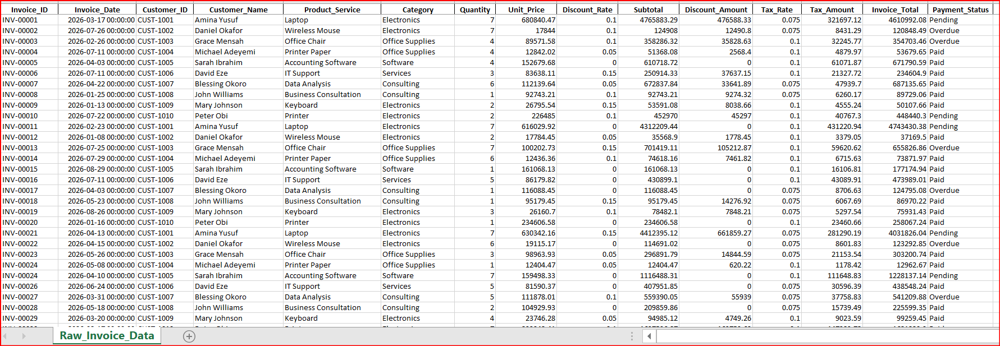
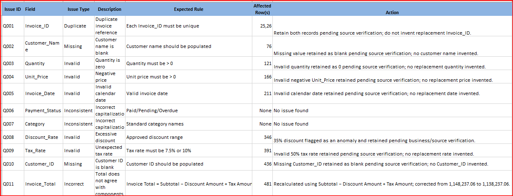
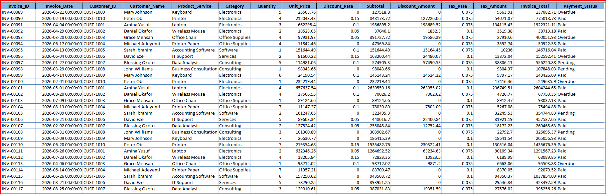
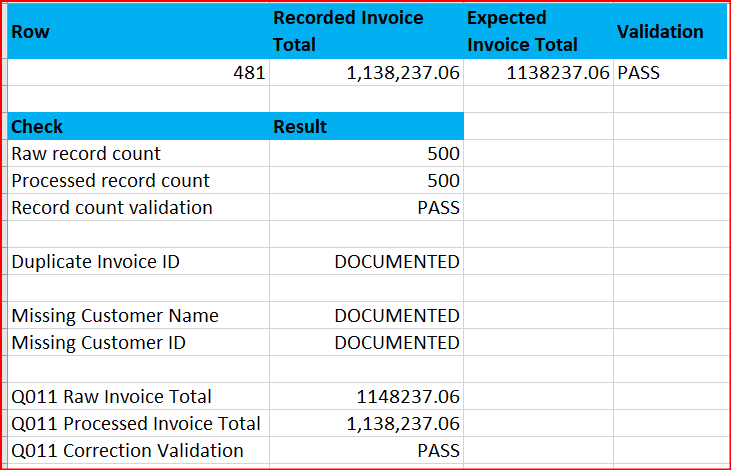
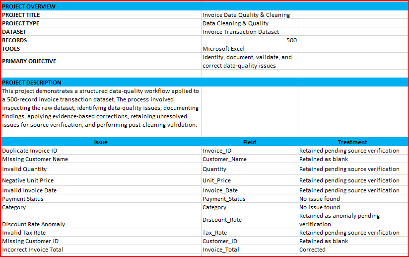
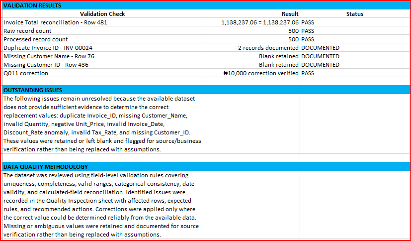
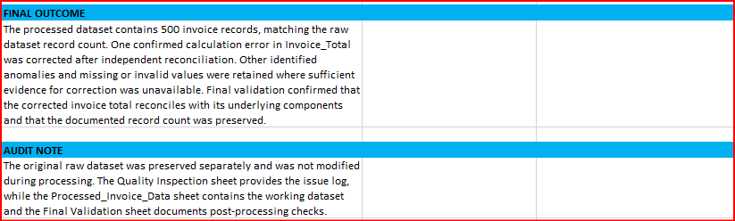

# Invoice Data Quality & Cleaning

A portfolio project demonstrating a structured invoice data-quality inspection, cleaning, validation, and documentation workflow using Microsoft Excel.

## Project Overview

This project applies a controlled data-quality workflow to a **500-record invoice transaction dataset**. The process covers inspection, issue logging, evidence-based correction, preservation of unresolved issues, and post-cleaning validation.

The objective was not to force every anomaly into a corrected value. Corrections were made only where the correct result could be established reliably from the available data. Missing or ambiguous values were retained and documented for source or business verification.

## Objectives

- Inspect invoice data against defined quality rules.
- Identify duplicate, missing, invalid, inconsistent, and calculation-related issues.
- Document findings with affected rows, expected rules, and actions.
- Apply only defensible corrections.
- Preserve the original dataset for auditability.
- Validate the processed dataset after cleaning.
- Produce a professional, traceable Excel data-quality workflow.

## Dataset

| Attribute | Details |
|---|---|
| Records | 500 invoice transactions |
| Primary tool | Microsoft Excel |
| Dataset type | Synthetic invoice transaction data |
| Data purpose | Portfolio demonstration |

> **Data privacy:** The dataset is synthetic and was created for this portfolio project. It does not represent real customer records.

## Data Quality Issues Reviewed

| Issue | Field | Treatment |
|---|---|---|
| Duplicate Invoice ID | `Invoice_ID` | Retained and documented for source verification |
| Missing Customer Name | `Customer_Name` | Retained as blank and documented |
| Invalid Quantity | `Quantity` | Retained and documented for source verification |
| Negative Unit Price | `Unit_Price` | Retained and documented for source verification |
| Invalid Invoice Date | `Invoice_Date` | Retained and documented for source verification |
| Discount Rate Anomaly | `Discount_Rate` | Retained as an anomaly pending verification |
| Invalid Tax Rate | `Tax_Rate` | Retained and documented for source verification |
| Missing Customer ID | `Customer_ID` | Retained as blank and documented |
| Incorrect Invoice Total | `Invoice_Total` | Corrected after reconciliation |

`Payment_Status` and `Category` were also inspected. No issue was found under the defined validation rules.

## Cleaning Approach

The workbook follows this workflow:

1. Preserve the raw dataset.
2. Inspect fields against defined data-quality rules.
3. Record findings in `Quality Inspection`.
4. Process the working dataset in `Processed_Invoice_Data`.
5. Correct only confirmed or independently calculable errors.
6. Retain ambiguous or missing values when a reliable replacement cannot be established.
7. Validate the processed data in `Final Validation`.
8. Summarize the methodology, findings, and outcome in `Data Quality Summary`.

## Validation Results

| Validation Check | Result | Status |
|---|---:|---|
| Invoice Total reconciliation — Row 481 | 1,138,237.06 = 1,138,237.06 | **PASS** |
| Raw record count | 500 | **PASS** |
| Processed record count | 500 | **PASS** |
| Duplicate Invoice ID — `INV-00024` | 2 records documented | **DOCUMENTED** |
| Missing Customer Name — Row 76 | Blank retained | **DOCUMENTED** |
| Missing Customer ID — Row 436 | Blank retained | **DOCUMENTED** |
| Q011 correction | ₦10,000 correction verified | **PASS** |

## Workbook Structure

The main Excel workbook contains five sheets:

- `Raw_Invoice_Data` — preserved source dataset.
- `Quality Inspection` — field-level issue log, affected rows, expected rules, and actions.
- `Processed_Invoice_Data` — working dataset after documented processing decisions.
- `Final Validation` — post-processing validation checks.
- `Data Quality Summary` — project overview, issue treatment, methodology, validation results, and audit notes.

## Workflow Screenshots

### 1. Raw Invoice Data



### 2. Quality Inspection



### 3. Processed Invoice Data



### 4. Final Validation



### 5. Data Quality Summary — Overview



### 6. Data Quality Summary — Validation and Methodology



### 7. Data Quality Summary — Outcome and Audit Note



## Repository Structure

```text
invoice-data-quality-cleaning/
│
├── README.md
│
├── documentation/
│   └── data_quality_summary.md
│
├── data/
│   ├── raw/
│   │   └── invoice_data_raw.xlsx
│   │
│   └── processed/
│       └── invoice_data_processed.xlsx
│
└── screenshots/
    ├── 01_raw_invoice_data.png
    ├── 02_quality_inspection.png
    ├── 03_processed_invoice_data.png
    ├── 04_final_validation.png
    ├── 05_data_quality_summary_overview.png
    ├── 06_data_quality_summary_validation.png
    └── 07_data_quality_summary_outcome.png
```

## Key Data-Quality Principle

A data-cleaning process should not create information that the source does not support. Where a value could not be reliably corrected, it was retained or left blank and documented for verification rather than being replaced with an assumption.

## Tools

- Microsoft Excel
- GitHub
- Data-quality inspection and validation techniques
- Formula-based reconciliation
- Audit documentation

## Portfolio Skills Demonstrated

- Data cleaning
- Data quality assurance
- Excel data validation
- Duplicate detection
- Missing-value handling
- Data-rule definition
- Anomaly identification
- Formula reconciliation
- Audit documentation
- Quality-control reporting

## Documentation

See [`data_quality_summary.md`](documentation/data_quality_summary.md) for the detailed project methodology, issue treatment, validation results, final outcome, and audit note.

## Project Outcome

The final workbook preserves the original 500-record dataset, documents identified quality issues, corrects the confirmed invoice-total calculation error, and provides validation evidence for the resulting processed dataset. Unresolved issues remain explicitly documented rather than being silently altered.
